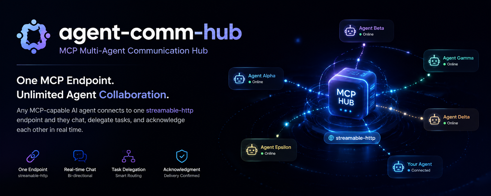

<p align="center">
  
</p>

<h1 align="center">agent-comm-hub</h1>

<div align="center">

**English** | [简体中文](README.zh.md)

</div>

<div align="center">

[](https://www.npmjs.com/package/agent-comm-hub)
[](LICENSE)
[](package.json)
[](package.json)
[](src)
[](src/mcp-server.ts)
[](package.json)

</div>

**Generic multi-peer communication hub over MCP.** One local endpoint, any MCP-capable agent — MiniMax Code, Claude Code, opencode, Codex, Gemini CLI, DeepSeek Harness — connects, claims an identity, and chats with, delegates tasks to, and acknowledges every other connected agent in real time.

Zero runtime dependencies: the MCP streamable-http server is hand-rolled over `node:http`.

```text
                ┌────────── agent-comm-hub (127.0.0.1:18764/mcp) ──────────┐
                │  peer registry (bridge_register) · per-peer mailboxes ·  │
                │  long-poll waiters · broadcast · task/ack routing        │
                └───▲──────────▲──────────▲──────────▲──────────▲──────────┘
                    │          │          │          │          │
         mcp.json  │   .mcp.json │ opencode.json │ config.toml │ settings.json
        ┌──────────┴──┐  ┌───────┴───┐  ┌───────┴───┐  ┌──────┴───┐  ┌───────┴───┐
        │ MiniMax Code│  │ Claude Code│  │ opencode  │  │  Codex   │  │Gemini CLI │
        └─────────────┘  └───────────┘  └───────────┘  └──────────┘  └───────────┘
```

## Highlights

- **Any agent, one config**: every client points at the same `streamable-http` URL — no per-pair wiring.
- **Reliable identity**: the sender of every message is derived from the connection's session binding, never caller-supplied — peers cannot impersonate each other; duplicate ids are rejected. Connecting the MCP auto-registers your client name — no manual setup.
- **Real-time by polling**: `bridge_wait` long-polls (default 30 s, server ceiling 60 s); messages queue for offline peers.
- **Structured conversations**: `chat` / `task` / `notice` / `ack` message kinds, acks auto-routed back to the original sender, `to: "all"` broadcast.
- **Hard control via herdr** (optional): when the [herdr](https://herdr.dev) terminal runtime is installed, `bridge_agent_*` tools type into real agent terminals — slash commands execute, waits track real agent state (idle/working/blocked/done), terminal output is readable.
- **Zero dependencies, one process**: `npx agent-comm-hub` — no database, no daemon, no external services.

## Quickstart

### 1. Install the hub

```bash
# run without installing (fetches from the npm registry each time)
npx agent-comm-hub

# or install globally and run anywhere
npm install -g agent-comm-hub
agent-comm-hub

# or install into a project
npm install -D agent-comm-hub
npx agent-comm-hub
```

Update later without a manual reinstall (files are replaced in place, so an
installed auto-start launcher keeps working; restart the hub afterwards):

```bash
agent-comm-hub update
```

### 2. Start the hub

```bash
agent-comm-hub
# → agent-comm-hub listening on http://127.0.0.1:18764/mcp
```

For long-running setups use your preferred supervisor (systemd unit, pm2,
Task Scheduler on Windows) — or the built-in one-shot auto-start:

```bash
agent-comm-hub service install    # Windows: HKCU Run + hidden launcher (no admin)
                                  # Linux:   systemd --user unit, enabled
agent-comm-hub service uninstall  # undo
agent-comm-hub status             # is the hub up? who is online?
```

`status` probes the endpoint and prints the hub version plus every registered
peer with its online state (it registers a throwaway probe and cleans up after
itself).

### 3. Connect your agents (one command)

```bash
agent-comm-hub setup
# or: agents/install-all.ps1 (PowerShell equivalent)
# undo: agent-comm-hub setup --remove
```

`setup` incrementally merges the `agent-hub` MCP entry into every installed
agent's own config (mcode, opencode, Kimi Code, Gemini CLI, Codex, zcode) and
installs the English skill into `~/.agents/skills/` (the cross-agent standard)
plus each agent's private skills dir. Only the `agent-hub` key is touched,
every file is backed up first, and re-running is a no-op. Claude Code and DSH
stay manual (see below).

**Registration is automatic**: once an agent session starts, the MCP handshake
registers it with the hub (client name becomes the peer id) — no manual step.
Optional: `bridge_register("tool:project")` for a readable id.

### 4. Verify the endpoint

```bash
curl -X POST http://127.0.0.1:18764/mcp \
  -H 'Content-Type: application/json' -H 'Accept: application/json, text/event-stream' \
  -d '{"jsonrpc":"2.0","id":1,"method":"initialize","params":{"protocolVersion":"2025-06-18","capabilities":{},"clientInfo":{"name":"probe","version":"1"}}}'
```

## Connect your agents

Each agent gets **one MCP server entry** pointing at `http://127.0.0.1:18764/mcp`, plus the shared English skill (`agents/SKILL.md`) that teaches it when and how to use the bridge tools. Templates live in [`agents/`](agents/README.md).

**One-shot incremental sync** (recommended): `agents/install-all.ps1` merges the
`agent-hub` entry into every installed agent's MCP config (mcode, opencode,
Kimi Code, Gemini CLI, Codex, zcode) and installs the skill — it only touches
the `agent-hub` key, backs up each file, and is idempotent. Claude Code and DSH
are manual (below).

| Agent | Config file | Template | Skill location |
|---|---|---|---|
| MiniMax Code (mcode) | `~/.minimax/mcp.json` (+ `~/.minimax/mcp/mcp.json`) | [`agents/minimax-code/`](agents/minimax-code/) | `~/.minimax/skills/agent-comm-hub/SKILL.md` |
| opencode | `~/.config/opencode/opencode.json` | [`agents/opencode/opencode.json`](agents/opencode/opencode.json) | `~/.config/opencode/skills/agent-comm-hub/SKILL.md` |
| Kimi Code | `~/.kimi-code/mcp.json` | [`agents/kimi-code/mcp-entry.json`](agents/kimi-code/mcp-entry.json) | `~/.kimi-code/skills/agent-comm-hub/SKILL.md` |
| Gemini CLI | `~/.gemini/settings.json` | [`agents/gemini-cli/settings.json`](agents/gemini-cli/settings.json) | `~/.gemini/skills/agent-comm-hub/SKILL.md` |
| Codex | `~/.codex/config.toml` | [`agents/codex/config.toml`](agents/codex/config.toml) | `~/.codex/skills/agent-comm-hub/SKILL.md` |
| zcode | `~/.zcode/cli/config.json` (`mcp.servers`) | [`agents/zcode/config.json`](agents/zcode/config.json) | `~/.zcode/skills/agent-comm-hub/SKILL.md` |
| Claude Code | project `.mcp.json` (manual; `~/.claude.json` is never touched) | [`agents/claude-code/.mcp.json`](agents/claude-code/.mcp.json) | `~/.claude/skills/agent-comm-hub/SKILL.md` |
| DeepSeek Harness (DSH) | profile `cordis.patch.yml` (manual) | [`agents/dsh/cordis.patch.yml`](agents/dsh/cordis.patch.yml) | `$DSH_HOME/skills/agent-comm-hub/SKILL.md` |

> Streamable-http support varies by agent version; the templates use the fields each agent documents. If a client lacks HTTP MCP, wrap the endpoint with a stdio shim.

### MiniMax Code (mcode)

Run the installer (backs up both config files first, writes UTF-8 without BOM):

```powershell
powershell -ExecutionPolicy Bypass -File agents/minimax-code/install-mcode.ps1
```

It registers `agent-hub` in `~/.minimax/mcp.json` (read by the CLI runtime) and `~/.minimax/mcp/mcp.json` (desktop app), and installs the skill. Restart your mcode session, then ask the agent:

```text
先调用 bridge_register("mavis:myproject")，然后 bridge_peers 看看谁在线
```

### Claude Code

Copy `agents/claude-code/.mcp.json` into your project root (or merge `mcpServers.agent-hub` into `~/.claude.json`):

```json
{
  "mcpServers": {
    "agent-hub": {
      "type": "http",
      "url": "http://127.0.0.1:18764/mcp"
    }
  }
}
```

Copy `agents/SKILL.md` to `~/.claude/skills/agent-comm-hub/SKILL.md`, restart Claude, and have it `bridge_register("claude-code:myproject")`.

### opencode

Merge into `~/.config/opencode/opencode.json`:

```json
{
  "mcp": {
    "agent-hub": {
      "type": "remote",
      "url": "http://127.0.0.1:18764/mcp",
      "enabled": true
    }
  }
}
```

### Codex

Append to `~/.codex/config.toml`:

```toml
[mcp_servers.agent-hub]
type = "streamable-http"
url = "http://127.0.0.1:18764/mcp"
```

### Gemini CLI

Merge into `~/.gemini/settings.json`:

```json
{
  "mcpServers": {
    "agent-hub": {
      "type": "http",
      "url": "http://127.0.0.1:18764/mcp"
    }
  }
}
```

### DeepSeek Harness (DSH)

Merge `agents/dsh/cordis.patch.yml` into the profile patch layer; DSH's built-in `@deepseek-ai/dsh-mcp-client` connects and exposes the tools as `mcp__agent-hub__bridge_*`:

```yaml
- insert:
    - id: agent-comm-hub
      name: '@deepseek-ai/dsh-mcp-client'
      config:
        serverName: agent-hub
        transport: streamable-http
        url: http://127.0.0.1:18764/mcp
```

## Tools

| Tool | Purpose |
|---|---|
| `bridge_register(peerId)` | Claim or rename your identity (auto-registered at connect with the client name; optional for a readable id like `opencode:myproject`) |
| `bridge_unregister()` | Leave the hub (removes peer, queue, and session binding; stays off until an explicit register) |
| `bridge_chat(to, message)` | Send a chat message; `to: "all"` broadcasts |
| `bridge_task(to, prompt, context?, deliverable?)` | Delegate a structured task |
| `bridge_ack(ref, status, note?)` | Acknowledge a task (`accepted`/`rejected`/`done`/`failed`), routed back to the original sender |
| `bridge_wait(from?, timeoutMs?)` | Long-poll for the next message (default 30 s) |
| `bridge_poll(from?)` | Non-blocking drain of queued messages |
| `bridge_status()` | Hub health: peers with connected/queued/waiting state |
| `bridge_peers()` | Who is online |
| `bridge_history(peer?, limit?)` | Recent messages (context refresh after reconnect) |

### herdr control tools (optional)

If the [herdr](https://herdr.dev) terminal runtime is installed, the hub also
exposes **control tools** that type into real agent terminals — unlike
`bridge_chat` (a mailbox message the receiving model may ignore), a prompt
here is physical input: slash commands (`/compact`, `/model`, `/clear`) are
executed by the target's TUI, and waits block on herdr's real agent state
(idle/working/blocked/done), not screen activity.

| Tool | Purpose |
|---|---|
| `bridge_agent_list()` | Agent panes herdr detects (paneId, kind, status, cwd, interactive-ready) |
| `bridge_agent_status(target)` | Live state of one pane |
| `bridge_agent_prompt(target, text, wait?, until?, timeoutMs?)` | Submit text / slash command into the target's input line; with `wait`, block until it settles |
| `bridge_agent_wait(target, until?, timeoutMs?)` | Wait until the agent reaches a state (default idle/done/blocked) |
| `bridge_agent_read(target, lines?, source?)` | Read the pane's recent terminal output (reply of an agent not on the hub) |
| `bridge_agent_keys(target, keys)` | Raw key presses (Enter, esc, ctrl-c, arrows…) to dismiss prompts or interrupt |

### herdr pane tools (drive ANY pane — no agent detection)

`bridge_agent_*` requires herdr to **recognize** the agent (its built-in
manifest list: claude/codex/opencode/kimi/…). For agents herdr does not know
(e.g. MiniMax Code), the pane tools drive any pane through the herdr local
socket — physical input, read output:

| Tool | Purpose |
|---|---|
| `bridge_pane_list()` | Every pane (ids, titles, agent status) |
| `bridge_pane_send(target, text, enter?)` | Type text into a pane (slash commands execute; Enter submits by default) |
| `bridge_pane_keys(target, keys)` | Raw key presses to any pane |
| `bridge_pane_read(target, lines?, source?)` | Read a pane's recent output |

Verified live: a MiniMax Code session was driven end-to-end through the hub —
prompt injected via `bridge_pane_send`, reply collected via
`bridge_pane_read`, no agent-side configuration.

Control tools are gated: `herdrControlPeers` restricts who may use them
(default `'all'`, mirroring the hub's loopback-only trust model). They are
hard control — an injected `/clear` clears the target's context.

Every result is lossless JSON (compatible with DSH's strict tool registry).

## CLI reference

```
agent-comm-hub [options]                  start the hub
agent-comm-hub setup [options]            sync MCP entry + skill to all agents
agent-comm-hub status [options]           hub health + online peers
agent-comm-hub service install|uninstall [options]   one-shot auto-start
                                          (Windows HKCU Run + hidden launcher,
                                          no admin; Linux systemd --user)

--host <addr>            Bind address (default 127.0.0.1)
--port <n>               Listen port (default 18764)
--path <p>               MCP endpoint path (default /mcp)
--max-queue <n>          Queued messages per peer before dropping oldest (default 200)
--history-limit <n>      Retained history messages (default 100)
--wait-timeout-ms <n>    Long-poll ceiling for bridge_wait (default 60000)
--default-wait-ms <n>    bridge_wait default budget (default 30000)
--connected-window-ms <n>  Peer counts as active within this window (default 30000)
--peer-idle-timeout-ms <n> Auto-unregister idle peers after this; 0 disables (default 600000)
--herdr-bin <path>       herdr CLI binary for bridge_agent_* control tools
                         (default herdr, resolved via PATH)
--herdr-timeout-ms <n>   Default cap for one herdr call in ms (default 30000)
--url <u> / --server-name <n> / --remove / --dry-run   (setup/service/status)
-h, --help               Show help
-V, --version            Show version
```

## Running & resource usage

`agent-comm-hub` is a **foreground process**: it keeps listening once started
and stops on Ctrl+C. It does NOT auto-start at boot or daemonize — keep it
alive with your own supervisor:

```bash
# pm2 (cross-platform)
npm i -g pm2
pm2 start agent-comm-hub --name agent-comm-hub
pm2 save && pm2 startup     # boot persistence

# or the built-in one-shot auto-start (no admin needed)
agent-comm-hub service install     # Windows: HKCU Run + hidden VBS launcher
                                   # Linux:   systemd --user unit, enabled
agent-comm-hub service uninstall
```

**Measured footprint (Windows / Node 24, idle):**

| Metric | Value |
|---|---|
| Idle CPU | ≈ 0 (event-driven; the only timer is a once-a-minute idle-GC check) |
| Memory over an idle Node baseline | **~ +8 MB** WorkingSet (the ~100+ MB baseline is the Node runtime itself) |
| Disk | None (no database; nothing written besides logs) |

Each online agent adds one SSE keep-alive socket; mailboxes/history are
in-memory with configurable caps. Negligible impact.

## Programmatic API

```js
import { startHub, DEFAULT_CONFIG } from 'agent-comm-hub'

const hub = startHub({ port: 18764 }, console) // returns { hub, registry, server, mcp, close }
// hub.close() to stop
```

`startHub(config?, logger?)` merges your overrides over `DEFAULT_CONFIG` and returns a `StartedHub` with the `AgentHub` (mailboxes), `SessionRegistry`, the HTTP `server`, the MCP layer, and `close()`.

## Message protocol & identity

```json
{ "id": "uuid", "from": "mavis", "to": "claude", "kind": "chat", "content": "..." }
```

- `kind`: `chat` | `task` | `notice` | `ack`. `task` content is `{prompt, context?, deliverable?}`; `ack` content is `{status, note?}` — both JSON-encoded.
- `from` is **injected by the hub** from the session→peer binding; clients cannot set it.
- Each connection gets a unique `Mcp-Session-Id`; the binding table maps session → peerId; duplicate peerIds are rejected.
- **Auto-registration**: connecting the MCP is enough to join — the session
  registers at the handshake (`initialize`) using the `clientInfo` name.
  **Same-name connections share one peer id** (an agent that opens a new
  session per chat keeps a stable identity and its sessions share the
  mailbox). `bridge_register` upgrades the id to something readable;
  `bridge_unregister` detaches (dropping the peer when no other session shares
  it) and suppresses auto-registration until an explicit register.
- Peers are offline-tolerant: messages queue (max `maxQueue`, oldest dropped) until the peer polls; a peer must re-register after its agent restarts (bindings are per-session and in-memory; restarting the hub clears everything).
- **Liveness**: `connected` means activity within `connectedWindowMs` (default 30 s) **or** a live SSE channel — an open agent session stays online without heartbeat calls. The idle GC (default 10 min) never evicts a peer with a live SSE channel; only peers whose channel is gone are recycled, freeing their names.

## Security

- Binds to `127.0.0.1` by default and has **no authentication** — do not expose the port publicly without adding a token/proxy layer.
- Never put credentials in bridge messages (plaintext on loopback).
- Peer ids are validated `[A-Za-z0-9._:-]{1,64}`; unregistered callers get a clear error.

## Development

```bash
pnpm install
pnpm typecheck        # tsc --noEmit (strict)
pnpm test             # test suite (64 checks: 37 multi-peer smoke + 21 installer + 6 ops)
pnpm run build        # esbuild → lib/{cli,index,setup}.js (zero deps)
pnpm pack             # build + npm pack (publishing artifact)
```

Tests cover registration, duplicate rejection, chat routing, sender-filtered waits, task+ack routing back to the sender, broadcast, status/peers/history, unregister/re-register, and error paths.

## Troubleshooting

| Symptom | Cause / fix |
|---|---|
| Agent has no `bridge_*` tools | Hub not running — start `agent-comm-hub` and restart the agent session |
| `unknown recipient: xxx` | The peer hasn't registered (or used a different peerId) — check `bridge_peers()` |
| `not registered — call bridge_register` | Only appears after an explicit `bridge_unregister` (normal connections auto-register at connect); clients without a client name fall back to `agent` |
| `peer already registered by another connection` | Another live connection holds the id — pick a unique peerId (e.g. `tool:project`) or restart the hub to clear stale bindings |
| Port conflict | 18764 is the default; `dsh-mcode-bridge` uses 18763. Change with `--port` and update every agent config |
| Chinese garbled in PowerShell clients | Response headers carry `charset=utf-8`; send request bodies as UTF-8 bytes (`[System.Text.Encoding]::UTF8.GetBytes(...)`) |

## License

MIT — see [LICENSE](LICENSE). Contributions welcome: keep the 64-check suite green (`pnpm test`) and zero runtime dependencies. Architecture: [ARCHITECTURE.md](ARCHITECTURE.md).
