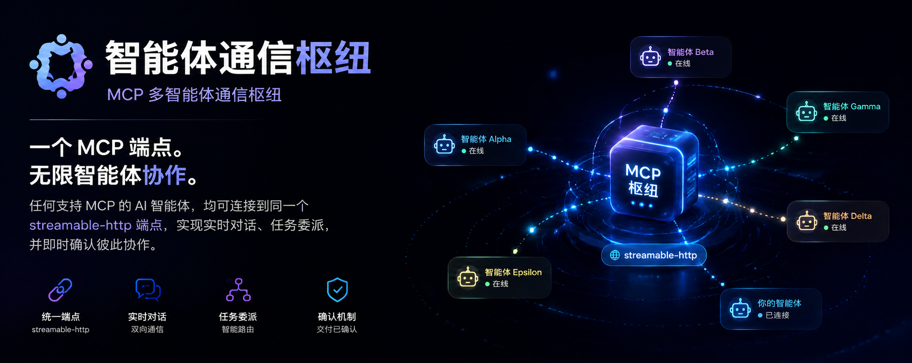

<p align="center">
  
</p>

<h1 align="center">agent-comm-hub</h1>

<div align="center">

[English](README.md) | **简体中文**

</div>

<div align="center">

[](https://www.npmjs.com/package/agent-comm-hub)
[](LICENSE)
[](package.json)
[](package.json)
[](src)
[](src/mcp-server.ts)
[](package.json)

</div>

**基于 MCP 的通用多端通信枢纽**。一个本地端点，任何支持 MCP 的 agent —— MiniMax Code、Claude Code、opencode、Codex、Gemini CLI、DeepSeek Harness —— 连上来即可实时互聊、互相派活、互相回执。

零运行时依赖：MCP streamable-http 服务器手写于 `node:http`。

```text
                ┌────────── agent-comm-hub (127.0.0.1:18764/mcp) ──────────┐
                │  身份注册表 · 每 peer 信箱 · 长轮询等待器 · 广播 · 回执路由 │
                └───▲──────────▲──────────▲──────────▲──────────▲──────────┘
                    │          │          │          │          │
                         MCP streamable-http（同一个 URL，各配各的）
                    │          │          │          │          │
        ┌───────────┴──┐ ┌──────┴───┐ ┌──────┴───┐ ┌──────┴───┐ ┌──────┴───┐
        │ MiniMax Code │ │ Claude   │ │ opencode │ │  Codex   │ │Gemini CLI│
        └──────────────┘ └──────────┘ └──────────┘ └──────────┘ └──────────┘
```

## 亮点

- **任意 agent,一份配置**：所有客户端指向同一个 `streamable-http` URL，无需两两接线
- **可靠身份**：消息的 `from` 由 hub 从会话绑定注入，客户端无法伪造；重名被拒；MCP 握手即自动注册（客户端名 = peer id），无需手动步骤
- **轮询即实时**：`bridge_wait` 长轮询（默认 30s，服务端上限 60s）；离线 agent 的消息排队等它
- **结构化会话**：`chat` / `task` / `notice` / `ack` 四类消息；回执自动路由回原发送者；`to: "all"` 广播
- **herdr 硬控制**（可选）：装了 [herdr](https://herdr.dev) 终端运行时后，`bridge_agent_*` 工具能直接往对方终端打字——斜杠命令真实执行、等待基于真实 agent 状态（idle/working/blocked/done）、可读终端输出
- **零依赖单进程**：`npx agent-comm-hub` —— 无数据库、无守护、无外部服务

## 快速开始

### 1. 安装 hub

```bash
# 免安装临时跑（每次从 registry 拉取）
npx agent-comm-hub

# 或全局安装，随处可用（推荐常驻用法）
npm install -g agent-comm-hub
agent-comm-hub

# 或装进项目
npm install -D agent-comm-hub
npx agent-comm-hub
```

之后想更新（免手动重装，文件原地替换，已装的自启动器不受影响；更新后重启 hub）：

```bash
agent-comm-hub update
```

### 2. 启动 hub

```bash
agent-comm-hub
# → agent-comm-hub listening on http://127.0.0.1:18764/mcp
```

常驻交给内置的一键自启（或 pm2）：

```bash
agent-comm-hub service install    # Windows：HKCU Run + 隐藏启动器（无需管理员）
                                  # Linux：systemd --user 单元并启用
agent-comm-hub service uninstall  # 撤销
agent-comm-hub status             # hub 是否在跑？谁在线？
```

`status` 探测端点并打印 hub 版本 + 每个已注册 peer 的在线状态（自带探针、用完即清理）。

### 3. 一键接入所有 agent

```bash
agent-comm-hub setup
# 或 PowerShell 版：agents/install-all.ps1
# 卸载：agent-comm-hub setup --remove
```

`setup` 会把 `agent-hub` 的 MCP 条目**增量合并**进每个已安装 agent 的配置
（mcode / opencode / kimi-code / gemini / codex / zcode），并把英文 SKILL 装到
`~/.agents/skills/`（跨 agent 标准位置）+ 各 agent 私有技能目录。只动
`agent-hub` 这一个键、每个文件先备份、幂等可重跑。Claude Code 与 DSH 手动（见下）。

**注册全自动**：agent 会话一启动，MCP 握手即完成注册（客户端名 = peer id），无需任何手动操作。可选：`bridge_register("工具名:项目名")` 换可读 id。

### 4. 验证端点

```bash
curl -X POST http://127.0.0.1:18764/mcp \
  -H 'Content-Type: application/json' -H 'Accept: application/json, text/event-stream' \
  -d '{"jsonrpc":"2.0","id":1,"method":"initialize","params":{"protocolVersion":"2025-06-18","capabilities":{},"clientInfo":{"name":"probe","version":"1"}}}'
```

## 接入各 agent

每个 agent 只需一条 MCP 配置指向 `http://127.0.0.1:18764/mcp`，加一份 SKILL（`agents/SKILL.md`，英文，教会 agent 何时用哪些 bridge 工具）。模板在 [`agents/`](agents/README.md)。

| Agent | 配置文件 | 模板 | Skill 位置 |
|---|---|---|---|
| MiniMax Code (mcode) | `~/.minimax/mcp.json`（+ `~/.minimax/mcp/mcp.json`） | [`agents/minimax-code/`](agents/minimax-code/) | `~/.minimax/skills/agent-comm-hub/SKILL.md` |
| opencode | `~/.config/opencode/opencode.json` | [`agents/opencode/opencode.json`](agents/opencode/opencode.json) | `~/.config/opencode/skills/agent-comm-hub/SKILL.md` |
| Kimi Code | `~/.kimi-code/mcp.json` | [`agents/kimi-code/mcp-entry.json`](agents/kimi-code/mcp-entry.json) | `~/.kimi-code/skills/agent-comm-hub/SKILL.md` |
| Gemini CLI | `~/.gemini/settings.json` | [`agents/gemini-cli/settings.json`](agents/gemini-cli/settings.json) | `~/.gemini/skills/agent-comm-hub/SKILL.md` |
| Codex | `~/.codex/config.toml` | [`agents/codex/config.toml`](agents/codex/config.toml) | `~/.codex/skills/agent-comm-hub/SKILL.md` |
| zcode | `~/.zcode/cli/config.json`（`mcp.servers`） | [`agents/zcode/config.json`](agents/zcode/config.json) | `~/.zcode/skills/agent-comm-hub/SKILL.md` |
| Claude Code | 项目根 `.mcp.json`（手动；**绝不碰 `~/.claude.json`**——含凭据） | [`agents/claude-code/.mcp.json`](agents/claude-code/.mcp.json) | `~/.claude/skills/agent-comm-hub/SKILL.md` |
| DeepSeek Harness (DSH) | profile `cordis.patch.yml`（手动） | [`agents/dsh/cordis.patch.yml`](agents/dsh/cordis.patch.yml) | `$DSH_HOME/skills/agent-comm-hub/SKILL.md` |

> 各 agent 对 streamable-http 的支持随版本演进；不支持的客户端可加 stdio 包装。

## 常驻运行与资源占用

`agent-comm-hub` 是**前台进程**：启动后持续监听，Ctrl+C 停止。它**不会**自动开机自启、不会自动后台化——常驻由你自己的 supervisor 负责：

```bash
# pm2（跨平台）
npm i -g pm2
pm2 start agent-comm-hub --name agent-comm-hub
pm2 save && pm2 startup     # 开机自启

# 或内置一键自启（无需管理员）
agent-comm-hub service install     # Windows：HKCU Run + 隐藏 VBS 启动器
                                   # Linux：systemd --user 单元并启用
agent-comm-hub service uninstall
```

**资源占用（本机实测，Windows / Node 24）**：

| 指标 | 数值 |
|---|---|
| 空闲 CPU | ≈ 0（纯事件驱动；唯一定时器是每分钟一次的空闲 GC 检查） |
| 内存（相对空闲 Node 基线） | **约 +8 MB**（WorkingSet；进程基线本身约 100+ MB 是 Node 运行时） |
| 磁盘 | 无数据库、无写盘（仅日志） |

每在线一个 agent 多一条 SSE 长连接（一个 socket）；信箱/历史都在内存（上限可配）。性能影响可以忽略。

## 工具

| 工具 | 作用 |
|---|---|
| `bridge_register(peerId)` | 认领/改名身份（连接即自动注册，此项可选用于可读 id） |
| `bridge_unregister()` | 离开 hub（移除 peer、队列与绑定；之后保持离线直到显式注册） |
| `bridge_chat(to, message)` | 发消息；`to: "all"` 广播 |
| `bridge_task(to, prompt, context?, deliverable?)` | 派结构化任务 |
| `bridge_ack(ref, status, note?)` | 回执（accepted/rejected/done/failed），自动回到原发送者 |
| `bridge_wait(from?, timeoutMs?)` | 长轮询收下一条消息（默认 30s；循环=实时监听） |
| `bridge_poll(from?)` | 非阻塞取走所有排队消息 |
| `bridge_status()` | 枢纽健康：各 peer 在线/队列/等待状态 |
| `bridge_peers()` | 谁在线 |
| `bridge_history(peer?, limit?)` | 最近往来消息（重连后恢复上下文） |

### herdr 控制工具（可选）

装了 [herdr](https://herdr.dev) 终端运行时后，hub 还会暴露一组**控制工具**，直接往真实 agent 终端打字——与 `bridge_chat`（信箱消息，对方模型可能不理）不同，这里的 prompt 是物理输入：斜杠命令（`/compact`、`/model`、`/clear`）由对方 TUI 真实执行，等待基于 herdr 的真实 agent 状态（idle/working/blocked/done），而不是屏幕活动。

| 工具 | 作用 |
|---|---|
| `bridge_agent_list()` | herdr 检测到的 agent pane（paneId、类型、状态、cwd、是否可输入） |
| `bridge_agent_status(target)` | 单个 pane 的实时状态 |
| `bridge_agent_prompt(target, text, wait?, until?, timeoutMs?)` | 往对方输入行提交文本/斜杠命令；`wait` 时阻塞到它安定 |
| `bridge_agent_wait(target, until?, timeoutMs?)` | 等对方进入某状态（默认 idle/done/blocked） |
| `bridge_agent_read(target, lines?, source?)` | 读 pane 最近终端输出（没接 hub 的 agent 的回复） |
| `bridge_agent_keys(target, keys)` | 原始按键（Enter、esc、ctrl-c、方向键…）处理弹窗或打断 |

控制工具带权限门控：`herdrControlPeers` 限定谁能用（默认 `'all'`，与 hub 仅本机的信任模型一致）。这是**硬控制**——注入的 `/clear` 会清掉对方上下文。

所有返回都是 lossless JSON（兼容 DSH 的严格工具注册表）。

## CLI 参考

```
agent-comm-hub [options]                  启动 hub
agent-comm-hub setup [options]            增量同步 MCP 条目 + SKILL 到所有 agent
agent-comm-hub status [options]           hub 健康 + 在线 peer
agent-comm-hub service install|uninstall [options]   一键自启
                                          （Windows HKCU Run + 隐藏启动器，无需管理员；
                                            Linux systemd --user）

--host <addr>             绑定地址（默认 127.0.0.1）
--port <n>                端口（默认 18764）
--path <p>                MCP 路径（默认 /mcp）
--max-queue <n>           每 peer 队列上限，溢出丢最旧（默认 200）
--history-limit <n>       保留的历史条数（默认 100）
--wait-timeout-ms <n>     bridge_wait 长轮询上限（默认 60000）
--default-wait-ms <n>     bridge_wait 默认预算（默认 30000）
--connected-window-ms <n> 活跃窗口（默认 30000）
--peer-idle-timeout-ms <n> 空闲 GC 超时；0 关闭（默认 600000）
--herdr-bin <path>        bridge_agent_* 控制工具的 herdr CLI 二进制
                          （默认 herdr，走 PATH）
--herdr-timeout-ms <n>    单次 herdr 调用默认上限 ms（默认 30000）
--url <u> / --server-name <n> / --remove / --dry-run   （setup/service/status 用）
-h, --help / -V, --version
```

## 编程接口

```js
import { startHub, DEFAULT_CONFIG } from 'agent-comm-hub'

const hub = startHub({ port: 18764 }, console) // 返回 { hub, registry, server, mcp, close }
// hub.close() 停止
```

`startHub(config?, logger?)` 在 `DEFAULT_CONFIG` 之上合并你的覆盖值，返回包含
`AgentHub`（信箱）、`SessionRegistry`、HTTP `server`、MCP 层与 `close()` 的句柄。

## 消息协议与身份

```json
{ "id": "uuid", "from": "mavis", "to": "claude", "kind": "chat", "content": "..." }
```

- `kind`：`chat` / `task` / `notice` / `ack`。`task` 内容为 `{prompt, context?, deliverable?}`；`ack` 内容为 `{status, note?}`——均 JSON 编码
- `from` **由 hub 注入**（来自会话→peer 绑定），客户端无法设置
- 每条连接有唯一 `Mcp-Session-Id`；绑定表记录 session → peerId；重名被拒
- **自动注册**：握手（`initialize`）即用 `clientInfo` 名注册；**同名连接共享一个 peer id**（一个 agent 开多个会话身份稳定、信箱共享）。`bridge_register` 换可读 id；`bridge_unregister` 注销（无其他会话共享时才移除 peer）
- **离线容忍**：消息排队（上限 `maxQueue`，满丢最旧）；hub 重启会清空全部绑定（agent 重连后自动重新注册）
- **在线语义**：`connected` = 最近 `connectedWindowMs`（默认 30s）内活跃 **或** SSE 通道存活——会话开着就显示在线，无需心跳；空闲 GC（默认 10 分钟）**不会**清理有活跃 SSE 的 peer，只回收真正断连的

## 安全

- 默认只绑 `127.0.0.1` 且**无鉴权**——不要直接暴露公网；跨端请加 token/代理层
- 不要把凭据写进消息（回环明文）
- peerId 校验 `[A-Za-z0-9._:-]{1,64}`；未注册调用有明确报错

## 开发

```bash
pnpm install
pnpm typecheck        # tsc --noEmit（strict）
pnpm test             # 测试套件（64 项：37 多端冒烟 + 21 安装器 + 6 运维）
pnpm run build        # esbuild → lib/{cli,index,setup}.js（零依赖）
pnpm pack             # 构建 + npm pack（发布产物）
```

## 故障排查

| 症状 | 原因 / 解决 |
|---|---|
| agent 没有 `bridge_*` 工具 | hub 没跑——启动 `agent-comm-hub` 并重启 agent 会话 |
| `unknown recipient: xxx` | 对方未注册（或用了别的 peerId）——先 `bridge_peers()` |
| `not registered — call bridge_register` | 仅在显式注销后出现（正常连接会自动注册）；客户端没上报名字时会用 `agent` 兜底 |
| `peer already registered by another connection` | 有人占了该 id——换个唯一 id（如 `工具:项目`）或重启 hub 清理 |
| 端口冲突 | 默认 18764（dsh-mcode-bridge 用 18763）——`--port` 换端口并同步各 agent 配置 |
| PowerShell 客户端中文乱码 | 响应头已带 `charset=utf-8`；发送时用 `[System.Text.Encoding]::UTF8.GetBytes(...)` |

## 许可

MIT —— 见 [LICENSE](LICENSE)。欢迎贡献：保持测试全绿（`pnpm test`）与零运行时依赖。架构说明见 [ARCHITECTURE.md](ARCHITECTURE.md)。
